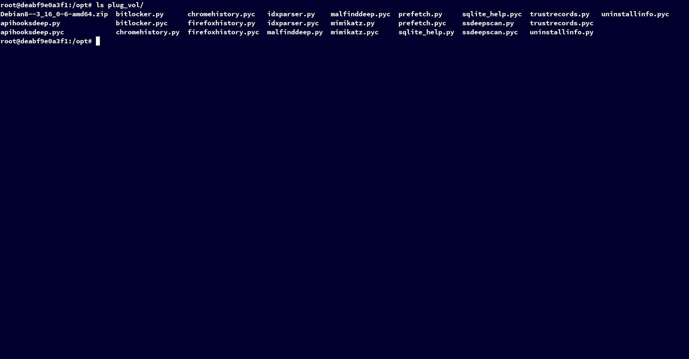
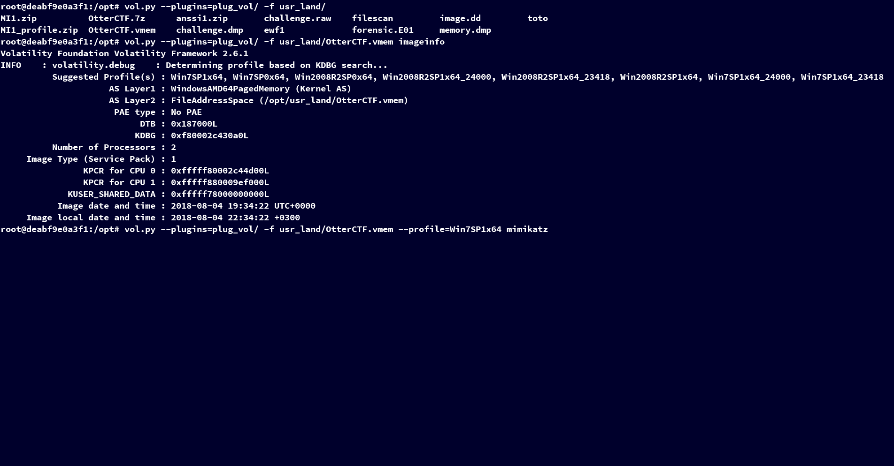
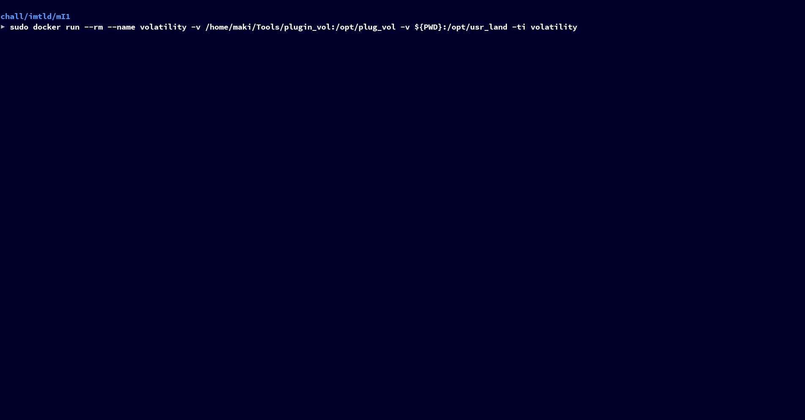

 Volatility

Volatility is a tool used to analyze memory dump.

Volatility GitHub: https://github.com/volatilityfoundation/volatility

## Building

```bash
$ sudo docker build . -t volatility
```

## Installation

```bash
$ sudo cp run.sh /usr/local/bin/volatility
```

## How it works

```bash
$ cat run.sh
#!/bin/bash

sudo docker run --rm --name volatility \
	-v /home/maki/Tools/plugin_vol:/opt/plug_vol \
	-v ${PWD}:/opt/usr_land \
	-ti volatility
```

The `/home/maki/Tools/plugin_vol` is the directory where volatility plugins are stored. Custom profile (for example: Linux), are considered as volatility plugins.

## PoC

1 - Linux memory dump



2 - Mimikatz plugin



3 - Bitlocker plugin


